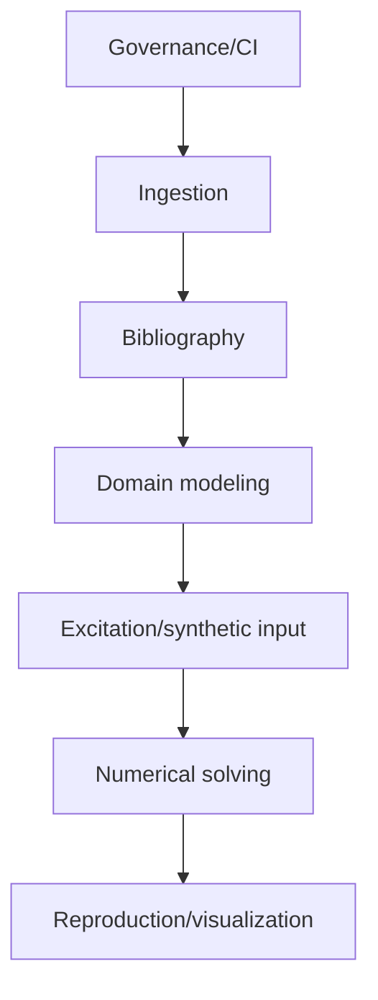

# Architecture Specification

> Generated by openlore v1.0.0 on 2026-08-06 07:33

## Purpose

This document describes the architectural patterns and structure of the system.

## Architecture Style

Layered architecture with a per-article vertical-slice convention on top: a common
ingestion/validation layer (scripts/, .github workflow gate) sits above per-article domain layers
(articles/<slug>/src/) that each implement model -> excitation/data-generation -> numerical solver
-> synthetic dataset stages. Cross-cutting concerns (bibliography aggregation, structural
validation, PDF preprocessing) are centralized in scripts/ and enforced in CI, while each article's
simulation code is self-contained and independently testable.

## Requirements

### Requirement: LayeredArchitecture

The system SHALL maintain separation between:
- Governance/CI (Enforce CONSTITUTION.md structural rules and bibliography consistency before merge)
- Ingestion (Convert raw article PDFs into token-efficient essence for downstream processing without committing copyrighted source text)
- Bibliography (Aggregate per-article metadata into a single BibTeX references file)
- Domain modeling (Represent the physical/mechanical system under study as assembled substructure matrices (mass/stiffness/damping) and derive state-space/modal properties)
- Excitation/synthetic input (Generate synthetic forcing/excitation signals and full synthetic datasets standing in for proprietary data)
- Numerical solving (Integrate the assembled state-space system over time to produce the dynamic response)
- Reproduction/visualization (Notebooks that reproduce the article's analysis and visualize results)

#### Scenario: LayerSeparation
- **GIVEN** a request from the presentation layer
- **WHEN** business logic is needed
- **THEN** the presentation layer delegates to the business layer
- **AND** direct database access from presentation is prohibited

### Requirement: SecurityModel

The system SHALL implement security via: No runtime authN/authZ — this is a local/CI tooling repo, not a service. The relevant control is content governance, not access control: PDFs and full article text are never committed (copyright compliance, enforced by ArticleStructureValidator checking for absence of source PDFs), and any PR affecting articles/** must pass the CI gate before merge. Human confirmation is required (per CLAUDE.md) before adding new taxonomy keywords or pushing/opening PRs.

#### Scenario: AuthenticatedAccess
- **GIVEN** an unauthenticated request
- **WHEN** accessing protected resources
- **THEN** access is denied

## System Diagram

## Layer Structure

### Governance/CI

**Purpose**: Enforce CONSTITUTION.md structural rules and bibliography consistency before merge
**Location**: `scripts/validate_article.py (ArticleStructureValidator), .github/workflows/article-pr-checks.yml`

### Ingestion

**Purpose**: Convert raw article PDFs into token-efficient essence for downstream processing without committing copyrighted source text
**Location**: `scripts/extract_pdf_essence.py (PdfEssenceExtractor)`

### Bibliography

**Purpose**: Aggregate per-article metadata into a single BibTeX references file
**Location**: `scripts/generate_bibliography.py (BibliographyGenerator)`

### Domain modeling

**Purpose**: Represent the physical/mechanical system under study as assembled substructure matrices (mass/stiffness/damping) and derive state-space/modal properties
**Location**: `articles/2026-08-02-longitudinal-vibration-elevators/src/elevator_model.py (ElevatorMDOFModel)`

### Excitation/synthetic input

**Purpose**: Generate synthetic forcing/excitation signals and full synthetic datasets standing in for proprietary data
**Location**: `articles/.../src/excitations.py (ExcitationGenerator), articles/.../src/generate_synthetic_data.py (SyntheticElevatorDataGenerator, generate_scenario)`

### Numerical solving

**Purpose**: Integrate the assembled state-space system over time to produce the dynamic response
**Location**: `articles/.../src/solver.py (RK4Solver.step, ElevatorDynamicsSolverService)`

### Reproduction/visualization

**Purpose**: Notebooks that reproduce the article's analysis and visualize results
**Location**: `articles/<slug>/notebook (per article, implied by CONSTITUTION.md requirement)`

## Data Flow

A user runs /vigilar-articulo with a URL or PDF -> PdfEssenceExtractor filters the PDF to essential
sections (abstract/methods/results) to reduce token cost -> Claude produces summary + taxonomy
classification -> reusable simulation code is authored per article (model assembly in
ElevatorMDOFModel -> excitation signals from ExcitationGenerator -> ElevatorDynamicsSolverService
assembles state-space matrices and drives RK4Solver ->
SyntheticElevatorDataGenerator.generate_scenario produces synthetic time-series datasets) -> outputs
(summary, code, synthetic data, notebook) are written into articles/<slug>/ ->
ArticleStructureValidator checks the resulting directory against CONSTITUTION.md ->
BibliographyGenerator aggregates metadata.yaml across all articles into references.bib -> CI
workflow (article-pr-checks.yml) runs validation/checks as a merge gate. No database; the filesystem
(articles/ directory tree) is the persistence layer.

## External Integrations

| System | Purpose |
|--------|---------|
| Claude (article summarization/classification, invoked via the /vigilar-articulo command) | External integration |
| GitHub Actions (CI gate on PRs touching articles/**) | External integration |
| PDF source articles referenced only by source_url/DOI, never committed | External integration |
